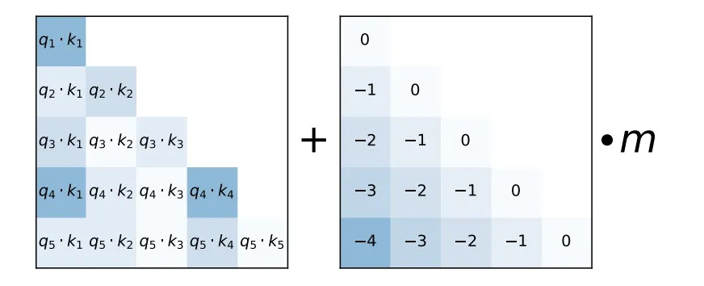

# Train Short, Test Long: Attention with Linear Biases (ALiBi) Enables Input Length Extrapolation 

This repository contains the ALiBi code and models for our paper Train Short, Test Long. This file explains how to run our experiments on the WikiText-103 dataset. Read the paper [here](https://ofir.io/train_short_test_long.pdf). 


<p align="center">
  
</p>

Attention with Linear Biases (ALiBi) is very simple! Instead of adding position embeddings at the bottom of the transformer stack (which we don't) we add a linear bias to each attention score, as depicted in the figure above. The 'm' hyperparam is head-specific and is not learned- it is set at the beginning of training. We have a function that automatically generates these m values given the number of heads in the model. 

ALiBi allows the model to be trained on, for example, 1024 tokens, and then do inference on 2048 (or much more) tokens without any finetuning. It's also able to improve performance, even when not extrapolating, in lower resource language modeling settings. 

The implementation is very simple.

0. Remove the position embeddings from the model: https://github.com/ofirpress/attention_with_linear_biases/blob/master/fairseq/models/transformer.py#L941
1. Set up the relative bias matrix, here: https://github.com/ofirpress/attention_with_linear_biases/blob/master/fairseq/models/transformer.py#L742
2. Add the bias matrix to the mask, which is then added in each attention score computation: https://github.com/ofirpress/attention_with_linear_biases/blob/master/fairseq/models/transformer.py#L1011
3. (This might not be necessary in other frameworks.) Move the mask computation to before the layer loop, to make the transformer a tiny bit faster: https://github.com/ofirpress/attention_with_linear_biases/blob/master/fairseq/models/transformer.py#L949


Thats it!

#### Citation:
```
@misc{press2021train,
      title={Train Short, Test Long: Attention with Linear Biases Enables Input Length Extrapolation}, 
      author={Ofir Press and Noah A. Smith and Mike Lewis},
      year={2021},
      eprint={2108.12409},
      archivePrefix={arXiv},
      primaryClass={cs.CL}
}
```

## WikiText-103
### Requirements and Installation

This repository is a fork of the [Fairseq](https://github.com/pytorch/fairseq) repository and so has the same requirements. 

Once you've installed the dependencies, you can install this repository by running:

```bash
pip install --editable .
```

### Preparing the data

To download and preprocess the data, run:

```bash
cd examples/language_model/
bash prepare-wikitext-103.sh
cd ../..


TEXT=examples/language_model/wikitext-103
fairseq-preprocess \
    --only-source \
    --trainpref $TEXT/wiki.train.tokens \
    --validpref $TEXT/wiki.valid.tokens \
    --testpref $TEXT/wiki.test.tokens \
    --destdir data-bin/wikitext-103 \
    --workers 20
```

### Training and Inference

To train a language model with attention with linear baises (ALiBi), on input sequences with 512 tokens, run:
```bash
python train.py --task language_modeling data-bin/wikitext-103 --save-dir wt103/ --arch transformer_lm_wiki103 --max-update 286000 --lr 1.0 --t-mult 2 --lr-period-updates 270000 --lr-scheduler cosine --lr-shrink 0.75 --warmup-updates 16000 --warmup-init-lr 1e-07 --stop-min-lr 1e-09 --optimizer nag --min-lr 0.0001 --clip-norm 0.1 --criterion adaptive_loss --max-tokens 9216 --update-freq 1 --tokens-per-sample 512 --seed 1 --sample-break-mode none --skip-invalid-size-inputs-valid-test --ddp-backend=legacy_ddp --fp16 --required-batch-size-multiple 1
```

For input sequences larger than 512 (and up to 2048) tokens, just change the --tokens-per-sample.

To train the model with inputs of length 3072, the --update-freq parameter must be changed to 3 and the --max-tokens parameter must be reduced to 3072 (and --tokens-per-sample must also be set to 3072). 

**If you run out of memory while training:** set --max-tokens to be 0.5 times what it was perviously and set --update-freq to be 2 times what it was previously. This results in a batched computation that is mathematically equivalent to the original command but requires less memory. If that doesn't work, set --max-tokens to be 0.25 times what it was previously and set the --update-freq to be 4 times what it was previously, and so on... 

#### Saved Checkpoints
If you'd like to download our trained models on WikiText-103, they are available here:
| Input Length      | Model | Log |
| ----------- | ----------- | ----------- |
| 64     | [⬇️ ](https://dl.fbaipublicfiles.com/train_short_test_long/wt103/alibi_wt103_L64.pt)          |[⬇️ ](https://dl.fbaipublicfiles.com/train_short_test_long/wt103/alibi_wt103_L64.log)          |
| 128    | [⬇️ ](https://dl.fbaipublicfiles.com/train_short_test_long/wt103/alibi_wt103_L128.pt)         |[⬇️ ](https://dl.fbaipublicfiles.com/train_short_test_long/wt103/alibi_wt103_L128.log)         |
| 256    | [⬇️ ](https://dl.fbaipublicfiles.com/train_short_test_long/wt103/alibi_wt103_L256.pt)         |[⬇️ ](https://dl.fbaipublicfiles.com/train_short_test_long/wt103/alibi_wt103_L256.log)         |
| 512    | [⬇️ ](https://dl.fbaipublicfiles.com/train_short_test_long/wt103/alibi_wt103_L512.pt)         |[⬇️ ](https://dl.fbaipublicfiles.com/train_short_test_long/wt103/alibi_wt103_L512.log)         |
| 1024   | [⬇️ ](https://dl.fbaipublicfiles.com/train_short_test_long/wt103/alibi_wt103_L1024.pt)        |[⬇️ ](https://dl.fbaipublicfiles.com/train_short_test_long/wt103/alibi_wt103_L1024.log)        |
| 1536   | [⬇️ ](https://dl.fbaipublicfiles.com/train_short_test_long/wt103/alibi_wt103_L1536.pt)        |[⬇️ ](https://dl.fbaipublicfiles.com/train_short_test_long/wt103/alibi_wt103_L1536.log)        |
| 2048   | [⬇️ ](https://dl.fbaipublicfiles.com/train_short_test_long/wt103/alibi_wt103_L2048.pt)        |[⬇️ ](https://dl.fbaipublicfiles.com/train_short_test_long/wt103/alibi_wt103_L2048.log)        |
| 3072   | [⬇️ ](https://dl.fbaipublicfiles.com/train_short_test_long/wt103/alibi_wt103_L3072.pt)        |[⬇️ ](https://dl.fbaipublicfiles.com/train_short_test_long/wt103/alibi_wt103_L3072.log)        |


Rename the file you downloaded to ```checkpoint_best.pt``` if you'd like to follow the directions below.

#### Inference

For nonoverlapping evaluation of the validation set, run:
```bash
l=1024; fairseq-eval-lm data-bin/wikitext-103/     --path wt103/checkpoint_best.pt  --sample-break-mode none --gen-subset valid   --max-sentences 1 --model-overrides "{'max_tokens':$l, 'tokens_per_sample':$l, 'max_target_positions':$l}"  --tokens-per-sample $l --max-tokens $l  --max-target-positions $l  --context-window 0
```

where ```l``` is set to the length of input subsequences during validation (```l```=1024 in the above example). 
